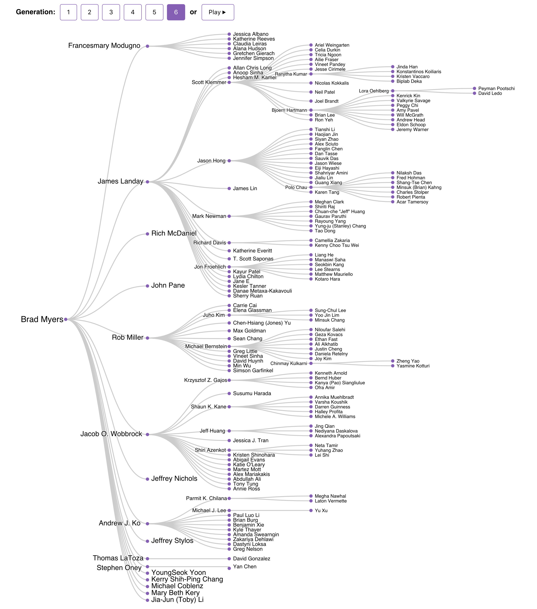

# Brad Myers's Advisee Tree

At the [ACM CHI 2017][chi] conference, [Brad Myers][brad] was awarded the [CHI Lifetime Research Award][award].  
In his keynote talk, he presented his advisee tree &mdash; all **6** generations, totaling **210** students! (updated Fall 2018)

The [original hierarchical document][doc] with affiliations, and the [visualized data][data], are available.

*Designed by [Fred Hohman][fred] (gen. 5), [Robert Pienta][robert] (gen. 5), and [Polo Chau][polo] (gen. 4).*

**[View the interactive visualization here][vis].**

***

[chi]: https://chi2017.acm.org
[brad]: http://www.cs.cmu.edu/~bam
[award]: http://www.sigchi.org/about/awards/2017-sigchi-awards#brad-a-myers

[doc]: https://docs.google.com/document/d/1NKheBhylXdkY_lmcV1QEP7CCLiwpMjE2L-KnWWh0Nvo/edit#heading=h.h4g51lbmhlnj
[data]: https://github.com/fredhohman/brad-myers-advisee-tree/blob/master/data.csv

[fred]: http://fredhohman.com
[robert]: http://www.cc.gatech.edu/~rpienta3/
[polo]: http://www.cc.gatech.edu/~dchau/

[vis]: http://fredhohman.com/brad-myers-advisee-tree